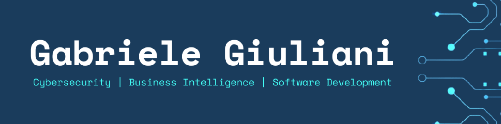
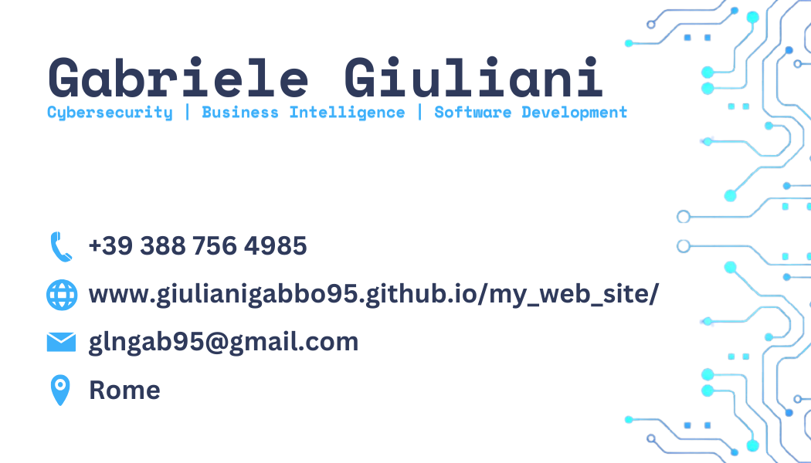

	

<!--

	

-->

<h1 align="center"> &#128075; Ciao, sono Gabriele Giuliani</h1>
<h3 align="center"> Cybersecurity, Business Intelligence, Software Development</h3> 
<h3 align="center"> Laureato Triennale in Informatica @Tor Vergata & Magistrale in Cyber Security @Sapienza</h3>

	
	
	

---

# &#127760; Versioni
&#127468;&#127463; [English](https://github.com/giulianigabbo95/giulianigabbo95/blob/main/README_eng.md) &#128072;

---

# &#128104;&#8205;&#128187; Chi Sono

## &#129309; Presentazione
Nutro interesse per sicurezza informatica, analisi dei dati e sviluppo software.  
Ho esperienze lavorative in contesti non solo IT che hanno permesso di sviluppare adattabilità, problem solving e responsabilità operativa.  
Attualmente sono alla ricerca di una posizione junior in ambito cybersecurity per applicare e consolidare le competenze acquisite durante il percorso di studi, con l'obiettivo di crescere professionalmente nel settore. 

## &#128236; Contatti
- e-mail: [glngab95@gmail.com](glngab95@gmail.com)
- LinkedIn: [Gabriele Giuliani](https://www.linkedin.com/in/gabriele-giuliani-22b862234)

## &#128188; Esperienza Lavorativa
- 2020 - 2026: Business Intelligence Analyst - Keplerus Data Science

## &#128218; Istruzione
- 2026: Corso Python & Machine Learning - ITConsulting
- 2025: Laurea Magistrale in Cyber Security - Università di Roma "La Sapienza"
- 2020: Laurea Triennale in Informatica - Università di Roma "Tor Vergata"

## &#128736; Competenze Teniche
- Linguaggi di Programmazione Imperativa:
	- C
	- C#
	- C++
	- Python
	- Java
	- Javascript
	- PHP
	- VB.NET
	- Arduino
	- Bash
- Linguaggi di Programmazione Dichiarativa:
	- SQL
	- Prolog
- Linguaggi di Markup, Documentazione & Stile:
	- HTML
	- CSS
	- Markdown
	- LaTeX
- Strumenti:
	- LLMs
	- Git
- Programmi: 
	- IDEs
	- Text Editors
	- Git Clients
	- SQL Clients
	- Power BI
	- Fabric
	- Docker
	- Slack
	- Suite Office
- Sistemi Operativi:
	- Windows
	- Ubuntu
	- Kali
	- Parrot
	- Android

## &#128161; Competenze Trasversali
- Proattività
- Adattabilità
- Narrazione
- Pensiero Critico
- Apprendimento Continuo
- Gestione del Tempo
- Lavoro di Gruppo
- Risoluzione dei Problemi

## &#9881; Progetti
- 2026: Image Recognizer Bot
- 2023: Tessera Sanitaria Elettronica Avanzata (TSEA)
- 2023: Arkadia Pub 4.0
- 2019: Monichol
- 2019: Automatic Vacation Generator System (AVGS)
- 2019: DataBase Mercatino dell'Usato

## 	&#128189; Eventi
- 2026: Hackathon ikigAIverse - NTTData
- 2025: Assessment Thunder PayRoll 2.0 - BIP
- 2025: Workshop Denuncia @via Web - SMC
- 2019: Hackathon Telemedicina - Università di Roma "Tor Vergata"

## &#128172; Lingue
- Italiano: Madrelingua
- Inglese: C1 (avanzato)
- Spagnolo: B1 (intermedio)
- Francese: A1 (base)

## &#127918; Passatempo
- Capture The Flag (CTF): partecipo a challenge di cybersecurity allenando problem solving e capacità di analisi su piattaforme come TryHackMe e Hack The Box
- Hackathon: partecipo a eventi di sviluppo software lavorando in team e realizzando prototipi in tempi ristretti

## &#128218; Obiettivi
Approfondimento di ethical hacking e network security, con esercitazioni pratiche in ambienti simulati tramite piattaforme hands-on dedicate.

## &#128196; CV
Scarica o leggi il mio Curriculum Vitae:
- [Formato Europass (pdf)](./CVs/CV_Gabriele_Giuliani_2026-06-01_(Europass)_IT_Medio_[ITA]_Template_Elegante_(Colonne).pdf)
- [Formato DOCs (docx)](https://docs.google.com/document/d/113f7qo048l0sQN8QfDyV-UYDVZGCX64m6aVYRvpLIYg/edit?usp=sharing)
- [Formato Word (docx)](./CVs/CV_Gabriele_Giuliani_2026-06-01_(Word)_IT_Medio_[ITA]_Template_NeoLaureato_(Lineare).docx)
- [Formato PlainText (txt) ]()
- [Formato LaTeX (pdf) [inglese]](https://www.overleaf.com/read/zqvdwhcwwqmn#20806a)

---

	<i>"Stay curious. Stay evolving."</i>

