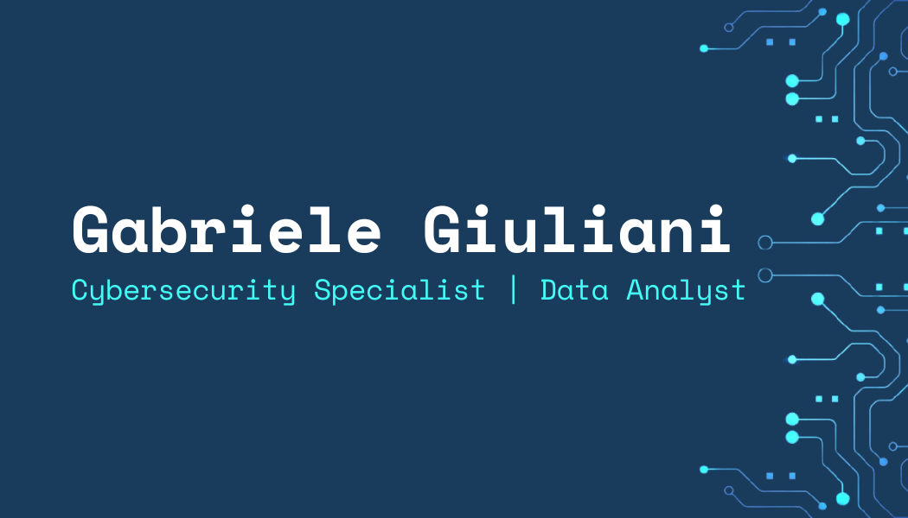

	

<h1 align="center">Hi there, I'm Gabriele Giuliani 👋</h1>
<h3 align="center">Software Engineer | SQL, Python, ETL | Graduated Informatica L-31 & CyberSecurity LM-66</h3>

	
	

---

<!--
**giulianigabbo95/giulianigabbo95** is a ✨ _special_ ✨ repository because its `README.md` (this file) appears on your GitHub profile.

Here are some ideas to get you started:

- 🔭 I’m currently working on ...
- 🌱 I’m currently learning ...
- 👯 I’m looking to collaborate on ...
- 🤔 I’m looking for help with ...
- 💬 Ask me about ...
- 📫 How to reach me: ...
- 😄 Pronouns: ...
- ⚡ Fun fact: ...
-->

# Autore
Sono Gabriele, un ragazzo dinamico, con una formazione accademica in Informatica e CyberSecurity, ambito professionale nel quale desidero crescere e specializzarmi, dopo molte esperienze in vari settori.

## Contatti
e-mail: giulianigabbo95@gmail.com  
LinkedIn: [Gabriele Giuliani](https://www.linkedin.com/in/gabriele-giuliani-22b862234)

## Esperienza Lavorativa
- 2020 - 2026: Data Analyst - Keplerus Data Science

## Formazione
- 2026: Corso Python & Machine Learning - ITConsulting
- 2025: Laurea Magistrale in Cyber Security -  Università La Sapienza
- 2020: Laurea Triennale in Informatica - Università di Tor Vergata

## Competenze Tecniche
- Linguaggi di Programmazione:
	- C
	- C#
	- Python
	- Java
	- VB.NET
	- Prolog
	- Arduino
- Linguaggi Dichiarativi:
	- SQL
- Markup & Documentazione:
	- Markdown
	- LaTeX
- Software & Strumenti: 
	- Microsoft Office
	- Visual Studio
	- Git
	- GitHub
	- Overleaf
- Sistemi Operativi:
	- Windows
	- Ubuntu
	- Kali
	- Parrot
	- Android

## Progetti
- 2026: Image Recognizer Bot
- 2025: Workshop Denuncia @via Web
- 2023: Tessera Sanitaria Elettronica Avanzata (TSEA)
- 2023: Arkadia Pub 4.0
- 2019: Monichol
- 2019: Automatic Vacation Generator System (AVGS)
- 2019: DataBase Mercatino dell'Usato

## Lingue Conosciute
- Italiano (Lingua Madre)
- Inglese: Ascolto B2, Produzione orale B2, Lettura B2, Interazione orale B2, Scrittura B2
- Spagnolo: Ascolto A2, Produzione orale A2, Lettura A2, Interazione orale A2, Scrittura A2

## Hobby
- CTF (Capture The Flag): partecipo a challenge di cybersecurity allenando problem solving e capacità di analisi su piattaforme come TryHackMe e Hack The Box
- Hackathon: partecipo a eventi di sviluppo software lavorando in team e realizzando prototipi in tempi ristretti

## 📚 Current Learning Focus
In continuo aggiornamento per trasformare conoscenza teorica in competenze concrete.

---

	<i>"Stay curious. Stay evolving."</i>

