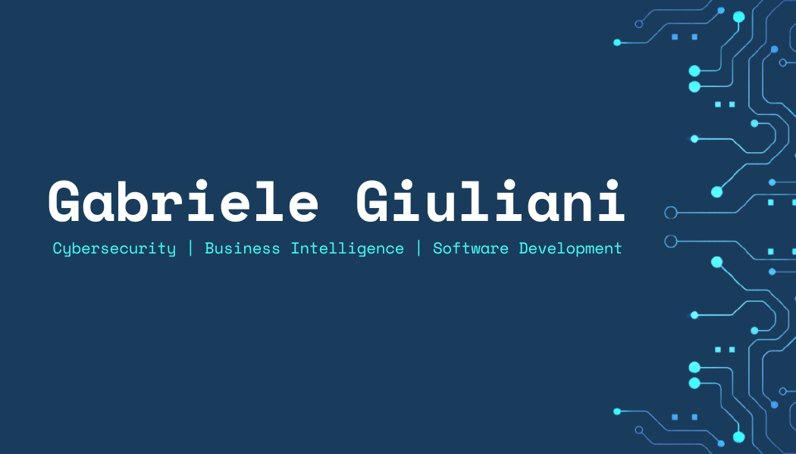

# :wave: Hi there, I'm Gabriele Giuliani

### Cybersecurity, Business Intelligence, Software Development
### Graduated in Computer Science @Tor Vergata & in Cyber Security @Sapienza

    
    
    

---

# :globe_with_meridians: Versions
:it: [Italiana](https://github.com/giulianigabbo95/giulianigabbo95/blob/main/README.md) :point_left:

---

# :man_technologist: About Me

## :handshake: Self Introduction
I am interested in cybersecurity, data analysis and software development.  
I have gained work experience in fields beyond IT, which has helped me develop adaptability, problem-solving skills and a sense of operational responsibility.  
I am currently looking for a junior role in cybersecurity to apply and build on the skills I acquired during my studies, with the aim of advancing my career in the sector.

## :mailbox: Contacts
- e-mail: [glngab95@gmail.com](glngab95@gmail.com) 
- LinkedIn: [Gabriele Giuliani](https://www.linkedin.com/in/gabriele-giuliani-22b862234)

## :briefcase: Work Experience
- 2020 - 2026: Business Intelligence Analyst - Keplerus Data Science

## :books: Education
- 2026: Python & Machine Learning Course - ITConsulting
- 2025: Master's Degree in Cyber Security - "Sapienza" University of Rome
- 2020: Bachelor's Degree in Computer Science - University of Rome "Tor Vergata"

## :hammer_and_wrench: Tech Skills
- Linguaggi di Programmazione Imperativa:
    - C
    - C#
    - C++
    - Python
    - Java
    - Javascript
    - PHP
    - VB.NET
    - Arduino
    - Bash
- Linguaggi di Programmazione Dichiarativa:
    - SQL
    - Prolog
- Linguaggi di Markup, Documentazione & Stile:
    - HTML
    - CSS
    - Markdown
    - LaTeX
- Strumenti:
    - LLMs
    - Git
- Programmi: 
    - IDEs
    - Text Editors
    - Git Clients
    - SQL Clients
    - Power BI
    - Fabric
    - Docker
    - Slack
    - Suite Office
- Sistemi Operativi:
    - Windows
    - Ubuntu
    - Kali
    - Parrot
    - Android

## :bulb: Soft Skills
- Proactivity
- Adaptability
- Storytelling
- Critical Thinking
- Lifelong Learning
- Time Management
- Team Working
- Problem Solving

## :gear: Projects
- 2026: Image Recognizer Bot
- 2023: Tessera Sanitaria Elettronica Avanzata (TSEA)
- 2023: Arkadia Pub 4.0
- 2019: Monichol
- 2019: Automatic Vacation Generator System (AVGS)
- 2019: DataBase Mercatino dell'Usato

## :minidisc: Events
- 2026: Hackathon ikigAIverse - NTTData
- 2025: Assessment Thunder PayRoll 2.0 - BIP
- 2025: Workshop Denuncia @via Web - SMC
- 2019: Hackathon Telemedicine - University of Rome "Tor Vergata"

## :speech_balloon: Languages
- Italian: Native
- English: C1 (Advanced)
- Spanish: B1 (Intermediate)
- French: A1/A2 (Basic)

## :video_game: Hobbies
- Capture The Flag (CTF): I take part in cybersecurity challenges to hone my problem-solving and analytical skills on platforms such as TryHackMe and Hack The Box
- Hackathon: I take part in software development projects, working in teams and creating prototypes to tight deadlines

## :brain: Current Learning Focus
An in-depth look at ethical hacking and network security, with practical exercises in simulated environments using dedicated hands-on platforms.

## :page_facing_up: CV
Download or read my Curriculum Vitae:
- [LaTeX Format (pdf)](https://www.overleaf.com/read/zqvdwhcwwqmn#20806a)
- [Europass Format (pdf) [Italian]](./CVs/CV_Gabriele_Giuliani_2026-06-01_(Europass)_Corto_[ITA]_Template_Elegante_(Colonne)_IT.pdf)
- [DOCs Format (docx) [Italian]](https://docs.google.com/document/d/113f7qo048l0sQN8QfDyV-UYDVZGCX64m6aVYRvpLIYg/edit?usp=sharing)
- [Word Format (docx) [Italian]](./CVs/CV_Gabriele_Giuliani_2026-06-01_(Word)_Medio_[ITA]_Template_NeoLaureato_(Lineare)_IT.docx)
- [PlainText Format (txt)](./CVs/CV_Gabriele_Giuliani_2026-06-01_(Blocco_Note)_Medio_[ITA]_(Lineare)_IT.txt)

---

    <i>"Non importa quanto vai piano, l'importante è non fermarsi"</i>

